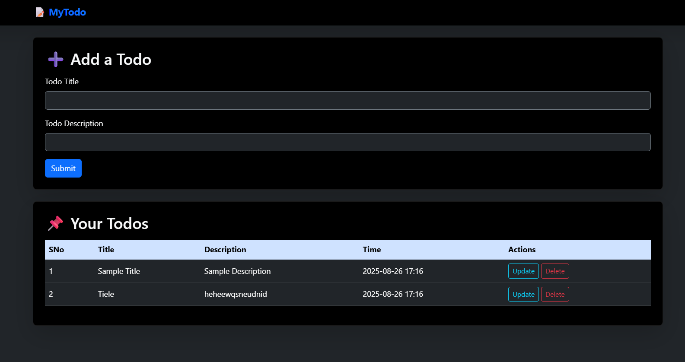

# Flask Todo App

A simple and beginner-friendly **Flask web application** that allows users to create, update, and delete their daily tasks.  
The app uses **Flask-SQLAlchemy** with SQLite for storing todos and comes with a modern **dark-themed UI** built using Bootstrap 5.

## Features

- Add new todos with a title and description.
- View all saved todos in a clean table layout.
- Update existing todos with new details.
- Delete todos when completed.
- Dark theme with modern and attractive UI.
- Lightweight and beginner-friendly project.

## Technologies Used

- **Python (Flask)**: Web framework for building the app.
- **Flask-SQLAlchemy**: Database ORM for managing todos.
- **SQLite**: Lightweight database for storing tasks.
- **HTML + Bootstrap 5**: For frontend templates and responsive design.
- **Custom CSS**: For dark mode and stylish look.

## Installation

1. Clone the repository:
   ```bash
   git clone https://github.com/vaishnav-reddy/Flask-Todo-App.git

## Navigate to the project directory: 

2.   cd Flask-Todo

## Create a virtual environment:

3.   python -m venv env

## Activate the environment:
  
4.  Windows: env\Scripts\activate
    MacOS: source env/bin/activate

## Install dependencies:
   
5.   pip install -r requirements.txt

## Run the application:
   
6.   python app.py

## Open your browser and go to:
    
    http://127.0.0.1:8000/

## 📂 Project Structure

```
flask-todo-app/
│  app.py
│  requirements.txt
│  README.md
|  static/
|   | css/
|   |   └─ style.css
|   | js/
|       └─ test.js
|  images/
|   | homepage.png
|   | update.png
└─ templates/
   │  base.html
   │  index.html
   │  update.html

```
### Home Page


### Update Page


## ⭐ Show Some Love!
If you like this project, **give it a star ⭐** and share it with your friends! 😊